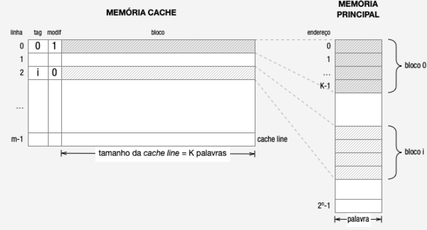
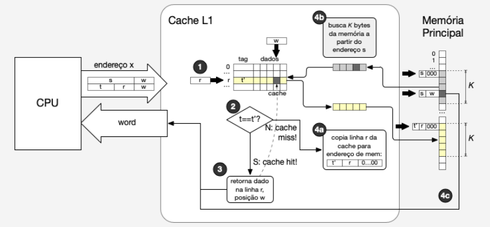

# MemoriaCache
Atividade de Mapeamento Direto de memória cache.

# Descrição
A próxima etapa do projeto consiste em implementar o modelo de memória cache por Mapeamento Direto.

A memória cache é formada por m "blocos" (chamados cache lines) de K palavras de memória, cada um precedido por uma "etiqueta" (tag) que identifica o bloco de memória principal sendo atualmente armazenado naquela cache line e uma flag para indicar se foi modificada ou não (veja figura abaixo).

Neste contexto, a CPU solicita o conteúdo da memória em um determinado endereço x que é enviado não mais diretamente à memória principal, mas sim à cache. Ao receber esta requisição de acesso a um endereço, o sistema deve verificar se o conteúdo do endereço solicitado está ou não em cache e tomar as medidas necessárias em caso negativo (cache miss), buscando o bloco contendo o endereço solicitado da memória principal (RAM) conforme ilustrado na figura abaixo.

# Especificação da Memória Cache
Uma vez que o tamanho da memória principal é de 16M, a CPU gerará endereços de 24 bits. A capacidade da cache deverá ser de 8192 palavras com cada cache line armazenando 64 palavras (i.e., K=64).

# Funcionamento Básico da Memória Cache (por Mapeamento Direto)
Endereços de 24 bits gerados pela CPU são divididos internamente nos seguintes blocos de bits:

w – especifica uma das K palavras de uma cache line ou bloco de memória (como K=64, w é um número de 6 bits);
r – especifica o índice do cache line (um número de 7 bits, uma vez que há 128 cache lines);
t – é a etiqueta (tag) que corresponde aos 11 bits restantes do endereço e serve para identificar qual o bloco que memória principal que se encontra atualmente na cache line;
s – corresponde à concatenação dos bits de t e r e representa o número do bloco de memória principal onde está a palavra à qual se deseja acessar.
Ao receber a solicitação de uma palavra de memória localizada em um endereço x, extrai-se r e t de x e faz-se então a verificação se t é igual ao tag t' contido na linha r da cache line (passo 2 na figura acima). Se forem iguais, houve um "cache hit" (i.e., a palavra solicitada está na cache) e então utiliza-se w para retornar à CPU a palavra na posição w dos dados da cache line (passo 3a na figura). Se houver um "cache miss", a cache line r corresponde a um outro bloco de memória. Se esta cache line tiver sido alterada, ela é copiada para a memória principal (a partir do endereço formado por [t' | r | 000000]) (passo 3b na figura). Em todo caso, o bloco s da memória principal é trazido para a cache line e a palavra no endereço solicitado é retornada à CPU (passo 4 na figura). Assim, a cache é atualizada e próximos acessos a endereços próximos produzirão um cache hit.

# Considerações de Implementação
Lembre-se que deslocar bits n posições à esquerda corresponde a multiplicar o número por 2n. Deslocar n bits à direita corresponde a dividir por 2n. Para selecionar um conjunto de bits, utilize as operações | ou & em Java.

Para testes, faça o seu programa imprimir na tela quando houver cache miss e qual endereço que o causou.
